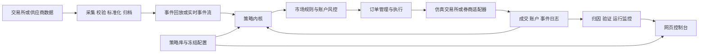

# 高频策略库建设与现有系统差距分析

日期：2026-09-16。审计基线：Git 提交 `b00a1af`，`main` 分支。本文依据仓库代码、本地已有研究产物、交易所及平台官方资料、原始研究论文编写。本文中的新策略规则、参数和工程排期是建设建议，尚未实现或回测，不代表已经验证有效。

## 1. 核心判断与建议方向

**A股可以开展高频研究，也存在受库存、交易规则和账户权限约束的日内交易，但普通A股股票不适合直接套用“空仓买入、几秒后卖出、无限重复”的交易模型。美股和港股也不能仅凭允许日内回转就认定适合所有高频策略。**

决定可行性的顺序应是：证券品种和账户权限 → 可成交的数据与通道 → 成本和可卖库存 → 信号持续时间 → 订单执行模型。市场标签只能做第一层分类。

对本项目，我建议把目标明确为：

> 建设一个具有真实逐笔数据回放、公开经典模型复现、市场规则约束、逐笔决策解释和模拟执行能力的高频策略研究与运行平台。第一阶段完成美股订单簿策略基线，第二阶段增加A股库存约束版本及境内可回转品种，港股优先研究ETF而非默认高换手普通股票。

如果老师明确要求普通股票，第一阶段聚焦美股股票，A股以“高频信号＋底仓日内增强”作为独立策略类别。如果允许ETF，境内符合当日回转规定的ETF和港股ETF都值得加入。ETF、可转债、期货应分别标记，不能用它们的回测冒充普通A股股票高频回测。

当前系统最需要修复的不是策略数量，而是四件事：

1. 每个策略的身份、经济假设、标的选择、买卖条件和退出条件必须完整可见。
2. 信号、仓位、执行、风控、组合算法必须分层，不能都计作一种“策略”。
3. 回测和运行必须引用同一个冻结策略版本，风险与仓位语义一致。
4. 高频结果必须由逐笔数据和可信撮合产生，日线收益不能替代。

## 2. 先统一“高频”含义

| 层次 | 本项目可采用的工作定义 | 需要的验证 | 当前系统情况 |
|---|---|---|---|
| 日频／低频策略 | 日线产生信号，数日至数月持有 | 日线、成本、样本外、风险验证 | 已有 |
| 日内策略 | 秒或分钟更新信号，日内调仓 | 分钟／逐笔行情、交易日历、日内执行和成本 | 尚无完整入口 |
| 微观结构策略 | 利用盘口、逐笔成交、订单流，预测下一跳或很短时段价格 | 报价／订单簿事件、因果时间线、队列与延迟 | 缺失 |
| 低延迟高频执行 | 高频报价撤改、短持仓、速度和队列位置显著影响收益 | 交易所事件回放、通道延迟测量、订单状态一致性、基础设施 | 缺失 |

以上是工程分类，不是统一法定界限。“1分钟K线”不是自动等于高频，“每秒运行一次Python”也不等于拥有可盈利的低延迟交易能力。

中国境内高频交易还有特定监管识别口径。沪深交易所2025年发布的实施细则以单账户每秒申报／撤单最高达到300笔以上，或全日最高达到20,000笔以上等标准识别高频交易；程序化交易的报告和行为管理并不只针对达到该标准的账户。应按当时有效规则和券商要求执行，而不是把阈值当作目标或规避边界。[上交所解释](https://www.sse.com.cn/aboutus/mediacenter/hotandd/c/c_20250403_10776805.shtml)、[深交所解释](https://www.szse.cn/aboutus/trends/news/t20250407_612782.html)。

因此，一个项目可以诚实地称为“高频微观结构策略复现平台”，但不能仅凭回放系统就称为“机构级低延迟实盘系统”。

## 3. 美股、港股、A股到底有何不同

### 3.1 市场适用性矩阵

| 维度 | 美国股票／ETF | 香港普通股票 | 香港ETF | 普通A股股票 | 境内可当日回转品种 |
|---|---|---|---|---|---|
| 当日买入后卖出 | 可以，但受账户、资金、保证金规则约束 | 可以，须满足账户和券商要求 | 可以，须满足账户和券商要求 | 普通现货买入不能直接当日卖出该新增库存 | 仅限规则明确允许的具体品种 |
| 做空 | 依赖借券、账户与卖空规则 | 指定证券、已安排借券及价格限制等 | 依具体证券和账户；存在特定规则豁免 | 不能默认可融券；需要实际券源、权限与规则 | 可回转不等于可做空 |
| 成本主要问题 | 点差、手续费、路由／场所费用、逆向选择 | 普通股票双边印花税对小价差高换手很不利 | ETF份额交易免印花税，但其他费用仍在 | 卖出税费、佣金、冲击和库存占用 | 按品种计费，不能套股票税费模板 |
| 主要建模难点 | 多交易场所、数据覆盖、报价与成交同步 | 最小价位／每手数量、午休、VCM、卖空约束 | 同左，另有做市和申赎机制 | 可卖数量、涨跌停、午休、集合竞价、停牌 | 回转资格、申赎、时差、赎回与成交规则 |
| 本项目适合的起点 | 订单簿失衡、订单流、库存做市的研究回放 | 成本后日内机会，作为后续适配 | 成本较友好的日内研究候选 | 底仓增强、执行优化、高频因子 | 在核验品种规则后做日内策略 |

表中的优先级是结合本仓库已有美股接口做出的工程判断，不是对各市场未来收益的排序。

**交收周期和可否当日卖出必须分开。** 美国多数证券自2024年5月28日起采用T+1标准交收，这不等同于普通A股新增股票库存的当日卖出限制。香港交易所资料说明证券交易一般按T+2交收。回测应分别记录交易可用库存、资金可用额度和最终交收状态。[美国SEC](https://www.sec.gov/newsroom/press-releases/2024-62)、[香港交易所证券市场运作](https://www.hkex.com.hk/Global/Exchange/FAQ/Securities-Market/Trading/Securities-Market-Operations?sc_lang=en)。

美国账户规则尤其不能机械沿用旧教程中的“所有高频账户一律25,000美元”。FINRA公布的新日内保证金要求自2026年6月4日起生效，允许券商过渡至2027年10月20日；实际账户可能仍受过渡安排和券商额外要求影响。策略运行前应读取券商实际购买力、保证金和交易限制。[FINRA最新说明](https://syndication.finra.org/content/understanding-new-intraday-margin-requirements)。

### 3.2 A股：可以研究高频，但库存模型不能省略

普通A股现货最直接的限制，是不能将当天新买的股票库存当作当天可卖库存。上交所交易规则同时列明债券ETF、货币ETF、黄金ETF、商品期货ETF、符合条件的跨境ETF等回转品种；并非所有ETF都可以T+0。境内股票ETF的一级市场申赎和二级市场买卖也不是同一件事。[上交所交易规则第3.1.4—3.1.5条](https://www.sse.com.cn/lawandrules/sselawsrules2025/fund/trading/c/c_20260424_10817739.shtml)。

以日初已有1,000股可卖库存为例：

- 上午卖出200股旧库存，下午买回200股，可以恢复总持仓，但买回部分不重新生成当天可卖额度。
- 上午先买200股，再卖200股，也必须有足够旧库存支撑卖出；当天新增库存仍锁定。
- 一天里累计卖出的旧库存及已冻结待卖库存受额度约束，不能把同一份底仓当作无限循环的T+0库存。
- 买回失败、跌停无法卖出、停牌、隔夜跳空会使策略不能按计划恢复底仓或风险预算。

建议账户至少分开维护：`total_qty`、`sellable_qty`、`today_buy_qty`、`frozen_sell_qty`，并在交易日切换、撤单、部分成交和公司行动时更新。

适合A股的高频方向有三类：

1. **底仓日内增强**：在已有持仓和可卖库存限制内，利用短时定价偏差调整敞口。业绩应相对“同一底仓不操作”的组合计算增量收益，同时保留整个账户的风险报表。
2. **执行优化**：已确定要买／卖哪些股票后，用TWAP、VWAP、POV及盘口驱动的执行减少成本。卖出仍受可卖库存约束。
3. **高频信号驱动较低频持仓**：用盘口／成交特征改善买入时点、次日收益预测或风险管理。特征可以高频，持仓可以隔夜，两者要分别标注。

融券、底仓和对冲工具也不能混为一谈。证监会2024年曾批准暂停转融券业务并强化融券监管，这至少说明“回测假定始终能借到任意股票”不是可接受的默认值；具体日期是否能融券必须使用当时券源和账户证据。[证监会公告](https://www.csrc.gov.cn/csrc/c100028/c7493852/content.shtml)。

境内税费和交易规则应按日期版本化。证券交易印花税自2023年8月28日起实施减半征收；不能用一套当前费率覆盖整个历史区间。[税务机关说明](https://shanghai.chinatax.gov.cn/gate/big5/shanghai.chinatax.gov.cn/zcfw/rdwd/202309/t468612.html)。上交所2026年修订还涉及基金收盘集合竞价及主板风险警示股票涨跌幅变化等，说明不能直接把旧教程中的板块、ST和时段规则写死。[2026年规则修订说明](https://www.sse.com.cn/aboutus/mediacenter/hotandd/c/c_20260424_10816474.shtml)。

### 3.3 港股：T+0的优势可能被成本抵消

香港普通股票交易通常对买卖双方各收取成交金额0.1%的印花税，另有交易费、征费及券商费用；印花税还有取整规则。仅印花税，一次近似等金额买卖就是约20基点。若某策略每轮只有3—5基点毛优势，即使预测方向正确，也可能无法覆盖该项成本。这里是费率推导的例子，并非某策略实测结果。[香港交易所收费表](https://www.hkex.com.hk/Services/Rules-and-Forms-and-Fees/Fees/Securities-%28Hong-Kong%29/Trading/Transaction?sc_lang=en)。

ETF份额的买卖／转让享有印花税豁免，因此“港股ETF”和“香港普通股票”应是两个不同成本模型。ETF免印花税不意味着其所有成份股套利交易也自动免税；做市商相关豁免有资格和条件。[香港税务局ETF说明](https://www.ird.gov.hk/eng/faq/ETFs.htm)、[HKEX做市商豁免条件](https://www.hkex.com.hk/-/media/HKEX-Market/Products/Securities/Exchange-Traded-Products/Launch/Stamp-Duty-Exemption-for-ETP-Market-Makers.pdf)。

港股卖空也不是任意价格任意证券都能卖。受规管卖空需遵守指定证券及tick rule等规则，部分品种或参与者另有豁免。香港适用证券还存在VCM，触发后在冷静期价格带内交易，不能描述成“完全没有价格约束”。[卖空规则](https://www.hkex.com.hk/services/trading/securities/overview/regulated-short-selling?sc_lang=en)、[交易机制](https://www.hkex.com.hk/Services/Trading/Securities/Overview/Trading-Mechanism?sc_lang=en)。

### 3.4 美股：适合做公开复现起点，但通道仍决定能否实盘

美股订单簿研究有较清楚的公开数据格式和经典文献。Nasdaq TotalView-ITCH提供订单层级信息；LOBSTER提供订单簿和消息文件及样例，适合先打通回放、特征和经典模型。[Nasdaq数据产品](https://www.nasdaqtrader.com/Trader.aspx?id=mddataproducts)、[LOBSTER格式](https://data.lobsterdata.com/info/DataStructure.php)、[LOBSTER样例](https://data.lobsterdata.com/info/DataSamples.php)。

但单个交易所的订单簿并不等于美国所有场所的完整流动性；IEX数据、合并最佳报价、某交易所深度和实际路由的成交不是同一个数据范围。公开样例也只能验证数据管线，不能用一两天样例证明稳定盈利。

现有Alpaca Paper可以保留用于账户与订单链路测试。其官方文档明确指出不模拟订单市场冲击、延迟造成的滑点及非立即成交限价单的队列位置，因此它不能单独验证盘口抢队列或做市收益。[Alpaca Paper说明](https://docs.alpaca.markets/us/v1.4.2/docs/paper-trading)。

## 4. 当前仓库究竟有什么策略

### 4.1 Python端策略盘点

策略注册入口为 `quant_system/strategies/__init__.py`。以下为代码逻辑概括，实际参数以各次运行配置为准。

| 标识／类 | 真正含义 | 标的选择 | 买卖／权重规则 | 分类 |
|---|---|---|---|---|
| `sma_cross` | 双均线趋势 | 配置固定池 | 快均线高于慢均线为多头；低于时空仓，允许做空时可空；活跃标的按信号分配 | 日频Alpha |
| `trend` | 中长周期时间序列趋势 | 配置固定池 | 中、长收益加权后的符号决定方向，活跃标的通过配置方法分配权重 | 日频Alpha＋仓位 |
| `cross_sectional_momentum` | 横截面动量 | 固定池内排名 | 跳过最近若干天后计算回看收益，取正收益前K名并分配资金 | 日频选股＋仓位 |
| `multi_horizon_trend` | 多周期连续趋势 | 固定池 | 多周期收益按波动标准化，经tanh压缩，结合逆波动并平滑目标 | 日频Alpha＋仓位 |
| `equal_weight` | 等权配置 | 所有输入标的 | 平均分配固定总预算 | 配置基准，不是新的预测Alpha |
| `rolling_risk_parity` | 滚动风险配置 | 有足够历史的标的 | `method`决定逆波动或等风险贡献等分配方法 | 配置算法 |
| `dual_momentum` | 双动量轮动 | 进攻池／防御池 | 优先正动量进攻标的前K；没有则找正动量防御标的；否则空仓 | 日频轮动 |
| `EnsembleStrategy` | 多策略信号融合 | 继承子策略池 | 固定权重，或基于子策略历史代理收益波动调整并向先验收缩 | 组合器 |
| `OnlineExpertEnsembleStrategy` | 在线专家组合 | 继承专家池 | 根据历史代理收益、估计成本及衰减分数更新专家权重 | 组合器，基准内部有使用 |

注册表支持7个基础策略名，`ensemble`走另一构造入口。在线专家组合虽然有实现，也加入了基准候选，但没有作为普通策略名注册；因此“类已存在”不等于“用户能从统一入口选择并运行”。

`BenchmarkRunner._strategies()`实际有10个候选，包括多个组合变体。旧文档中的“9个强基线”与当前代码不完全一致。策略数量应由注册表生成，而不应分别在README、页面和基准函数里手工维护。

### 4.2 当前生产候选到底买什么、为什么买

`configs/sota_production.yaml`的标的池为：

`VTI, QQQ, IWM, EFA, EEM, VNQ, TLT, IEF, TIP, GLD, DBC, BIL`。

这是固定的多资产ETF池，包含权益、地产、利率、通胀相关及现金类资产，不是从美股全市场动态选股。

组合先验权重为：

- 60%多周期趋势：21／63／126／252个交易日窗口，40日波动窗口，每5个bar更新，目标平滑系数0.35。
- 40%横截面动量：126日回看，跳过5日，选正动量前4个，每21个bar更新。
- 组合使用自适应权重：126日代理收益历史、最少60日、向先验收缩60%。所以60／40是先验，而不是永远不变的实际权重。
- 外部风险约束包括单标的25%、总敞口95%、资产组55%、目标波动12%和回撤控制。

卖出来源包括信号转弱、标的跌出前K、目标权重下降、风控缩仓或熔断。多周期平滑意味着原信号消失后也可能分步降仓，而不是立即清空。

还需说明一个易混淆点：子策略的“每5／21个bar更新信号”，不代表账户只在这些日子成交。回测引擎每天可根据最近目标与价格漂移重新检查调仓阈值。

因此，老师问“选了什么股、怎么买卖”时，系统本来可以给出明确回答；问题是这些信息分散在配置和源码，没有形成统一、可审阅的策略说明与当日决策记录。

### 4.3 网页端是另一套策略系统

`web_platform/src/engine.mjs`的引擎版本是 `course-daily-1.0.0`，仅提供：`sma`、`momentum`、`buy_hold`，单标的、只做多。允许池为：

`SPY, QQQ, IWM, EFA, EEM, TLT, IEF, GLD, DBC, SHY, AAPL, MSFT`。

它与Python生产候选池不同，也没有调用Python的多周期趋势组合。`server.mjs`请求的行情周期明确是 `1Day`。网页并非完全没有策略说明：`/api/v1/catalog`已提供双均线、绝对动量、买入持有描述；也保存策略和数据快照。但是这些不构成与Python一致的策略库。

更重要的是仓位语义不一致：

| 环节 | 当前规则 |
|---|---|
| 网页回测 | 固定初始资金100,000，按 `allocation` 建仓，信号变化时交易 |
| 网页手动计划 | 当前账户权益 × `allocation` 计算目标数量 |
| 网页自动策略 | 使用独立预算 `budget` 首次建仓；信号仍为多时保留已有数量 |
| Python回测 | 多资产目标权重、每日风险评估与再平衡检查 |

预算制并非错误，但若部署报告仍引用另一套分配规则，展示的回测收益就不能直接代表该运行实例。应在部署前生成与实际预算、持仓规则完全相符的回测版本。

## 5. 代码与已有研究结果揭示的实质差距

### 5.1 已有结果并非全部通过

本次读取了本地 `reports/sota_production/` 与 `reports/sota_benchmark/` 已有产物，没有重新运行这些长回测。运行清单记录数据共56,196行，区间为2008-01-02至2026-08-13，数据指纹以 `b49634d15347…` 开头。旧文档写56,184行，说明已有文档和产物发生漂移。已有清单还未记录代码提交指纹，因此本次只能确认文件内容，不能独立证明其生成时采用了哪个代码版本。

| 已有产物中的指标 | 数值 | 正确解读 |
|---|---:|---|
| 生产候选全样本CAGR | 6.57% | 日频多资产历史结果 |
| 同报告基准CAGR | 7.91% | 候选没有在绝对收益上胜过该基准 |
| 候选／基准Sharpe | 0.644／0.566 | 候选风险调整表现较高 |
| 候选／基准最大回撤 | -15.75%／-31.77% | 候选承担较低风险 |
| 开发集所选策略 | `adaptive_multi_alpha` | 应以它的留出表现报告选择结果 |
| 该候选留出CAGR／Sharpe | 7.25%／0.681 | 仍是现有模型下的估计 |
| 多重试验校正后Sharpe概率 | 49.32% | 低于代码设定50%门槛 |
| 基准总门禁 | FAIL | `validation_gates`中一项为false |

“回测有正收益”“Sharpe较高”“通过全部研究门禁”“高频可实盘”是四个不同结论。这里最多支持前两者的一部分，不能把未通过项隐藏，也不能为通过而临时下调门槛。

前一轮在Conda `quant-system`中运行的29项Python测试全部通过。它证明了这些测试覆盖的行为在该环境下成立，不证明策略有效，更不证明具备高频能力。网页全量测试在此前检查中因npm／依赖和构建产物缺失未完成，本报告没有将其计为通过。

### 5.2 高频迁移前必须处理的问题

| 优先级 | 代码／证据 | 问题 | 为什么重要 |
|---|---|---|---|
| P0 | `backtest.py:273–283` | 模拟开盘成交时，以当日最终volume限制成交量，用当日high-low计算冲击 | 把当时未知的信息用于成交模型；不能作为因果的高频回放 |
| P0 | `live.py:63` | 实时计划传 `current_drawdown=0.0`，未传实际组合波动 | 没有复现回测中的完整动态回撤／波动风险状态 |
| P0 | `engine.mjs`、`automation.mjs` | 回测的allocation与自动运行budget语义不同 | 回测实例与运行实例不能直接一一对应 |
| P0 | `strategies/base.py` | 接口只有bar→目标权重 | 无法表达挂撤单、改单、队列、订单有效期和成交反馈 |
| P0 | `backtest.py`与`config.py` | 252等日频参数和日内费用计提方式固定 | 换成秒线会错误年化、计息、解释窗口与换手预算 |
| P0 | 账户模型 | 缺少完整的按市场可卖库存、交收和交易阶段模型 | 直接跑A股日内会模拟现实不允许的交易 |
| P1 | `ensemble.py` | 子策略代理收益用前次目标乘收盘到收盘收益 | 不等于下一开盘成交后的真实子账户净收益，在线分配应校准 |
| P1 | `ensemble.py` | 权重clip后再次归一化 | 一般情形下归一化可能重新突破上下界，需要有界单纯形投影及可行性检查 |
| P1 | 两端注册和清单 | 策略类、基准候选、网页模板、文件名多套体系 | 无法知道页面运行的是否是论文对应的同一策略 |
| P1 | `ResearchRunner` | 当前明确拒绝ensemble参数研究 | 组合候选的研究入口和单策略研究入口并不统一 |
| P1 | `run_manifest` | 有配置、环境和数据指纹，缺完整代码版本／依赖锁定／审批状态 | 很难从结果恢复严格一致的策略运行 |

P0表示阻止本次高频终版目标的问题，不表示已证明每个已有日频收益都失效。成交模型问题的正确处理是：保留原日频结果作为历史基线，修正为只用已知数据或真实事件撮合，再重新比较；不能假定修正后的收益方向。

回测不是因为使用了历史high／low就一定错误：如果模拟整个bar内的成交，它们可以是事后回放信息。但当前代码把成交记在开盘附近，又使用整个交易日才确定的信息，因此时点与假设不一致。这个区别必须写清楚。

## 6. 对比主流平台，缺的究竟是什么

不能把所有“量化平台”当作同一类。日频研究平台、交易框架、订单簿仿真工具、机构低延迟基础设施解决不同问题。

| 对标对象 | 官方公开能力／定位 | 本项目最应补的能力 | 不能由此推断 |
|---|---|---|---|
| QuantConnect／LEAN | Universe、Alpha、Portfolio、Risk、Execution模块 | 明确选股与信号、仓位、执行的分工，统一策略生命周期 | 使用LEAN就自动拥有机构HFT能力 |
| RiceQuant／RQAlpha Plus | 日／分钟／tick回测，账户、T+1及公司行动等 | 境内证券规则和品种化账户模型 | tick快照回测等同逐订单队列回放 |
| JoinQuant | 策略编辑、回测、模拟研究流程 | 统一策略详情、参数、标的和回测记录入口 | 云端研究界面就是低延迟执行基础设施 |
| VeighNa／vn.py | 策略应用、交易接口、算法委托执行模块 | 事件驱动、策略运行管理、执行算法与Alpha分层 | 连接券商即自动获得真实排队信息 |
| NautilusTrader | L1／L2／L3及成交／bar数据、可插拔执行与延迟模型 | 统一事件模型、回放与运行共用策略内核 | 任何默认成交模型都准确适配所有市场 |
| HftBacktest | 盘口回放、队列与延迟建模 | 做市／盘口策略的专门执行验证 | 历史回放能反事实地重建自身订单对市场的全部影响 |

资料：[LEAN](https://www.quantconnect.com/docs/v2/writing-algorithms/algorithm-framework/overview)、[RQAlpha Plus](https://www.ricequant.com/doc/rqalpha-plus/tutorial.html)、[JoinQuant](https://www.joinquant.com/guide)、[vn.py算法执行](https://www.vnpy.com/docs/cn/community/app/algo_trading.html)、[Nautilus数据](https://nautilustrader.io/docs/latest/concepts/backtesting/data-and-venues/)、[Nautilus模型](https://nautilustrader.io/docs/latest/concepts/behavioral_models/)、[HftBacktest成交假设](https://hftbacktest.readthedocs.io/en/latest/order_fill.html)。

HftBacktest文档特别指出市场回放不能改变历史市场，本身无法完整反映自身市场冲击，部分成交也受模型假设限制；这正是应展示的模型边界，而不是工具选择后就可以删除的说明。

具体差距清单如下：

| 能力 | 当前状态 | 高频终版应达到 |
|---|---|---|
| 策略身份证 | 类名、配置、部分网页快照 | 稳定ID、名称、版本、来源、适用品种、状态 |
| 标的池 | 固定列表和网页白名单 | 历史时点可得的选择规则、每日成员及入选理由 |
| 数据 | 主要OHLCV日线 | 逐笔报价／成交／深度、事件序号、交易所与接收时间 |
| 回放 | 日线循环 | 确定性事件时钟，快照恢复、序号缺口检测 |
| 成交 | 点差、冲击、容量的bar近似 | 队列假设、延迟、部分成交、撤单竞争、手续费模型 |
| 状态 | 账户／订单已有部分实现 | 事件日志恢复、未知订单隔离、崩溃后对账与继续运行 |
| 市场规则 | 少量通用配置 | 品种、账户、日期版本的规则包 |
| 研究验证 | 留出、walk-forward、bootstrap已有 | 高频标签防泄漏、执行敏感性、分日统计、跨标的验证 |
| 成本归因 | 佣金和估计冲击等 | 毛Alpha、点差、税费、逆向选择、库存、延迟分别归因 |
| 界面 | 账户、教学、回测、手工／自动Paper | 策略库、运行实例、数据状态、订单链路、异常处置 |
| 生命周期 | 历史产物和手动配置 | 文献收录→实现→复现→样本外→模拟运行→受限发布 |
| 测试 | 29项Python系统测试 | 市场规则、事件顺序、恢复、撮合、回放确定性测试 |

研究系统中已经做好的数据指纹、报告导出、部分风险控制、订单幂等和审计可以保留。需要新增的是逐笔交易内核和统一策略契约，不必把已完成的低频研究代码全部推翻。

## 7. 主流高频策略应该如何收录

公开文献能复现经典模型和基线，不能据此声称复刻了某家机构当前的商业策略。策略库的“主流”应定义为公开研究和工具中有代表性的策略家族，而不是声称已经调查了私有机构策略的市场份额。

### 7.1 策略家族与复现顺序

| ID | 家族 | 核心依据／交易逻辑 | 数据和执行前提 | 复现定位 |
|---|---|---|---|---|
| HF-01 | 固定价差／库存偏移做市 | 双边报价，库存多则降低报价中心促进卖出 | 报价和成交，队列／成本／撤单模型 | 工程基准，必做 |
| HF-02 | Avellaneda–Stoikov做市 | 库存风险改变保留价格和报价宽度 | 价格波动、成交到达强度、库存边界 | 经典模型复现，必做 |
| HF-03 | GLFT库存约束做市 | 显式处理有限库存下的最优报价 | 与HF-02同口径，并验证参数和离散库存 | 第二阶段 |
| HF-04 | Queue Imbalance | 买卖队列不平衡预测下一次中间价方向 | 同步买卖价量；有交易层才成为策略 | 第一优先Alpha基线 |
| HF-05 | Order Flow Imbalance | 新增、撤销、成交造成的供需变化 | 按事件重建最佳报价变化及成交 | 第一优先Alpha基线 |
| HF-06 | 日内相对价值／配对 | 对冲残差偏离后回归 | 同步多资产数据、可做空／对冲、双腿执行 | 后续；非天然无风险 |
| HF-07 | Lead–lag | 领先资产变化预测滞后资产短时响应 | 严格接收时间、多资产对齐、低延迟 | 后续，重点防时间错配 |
| HF-08 | ETF／篮子相对价值 | ETF与可交易对冲组合偏离 | 篮子价格、申赎／券源、FX、同步性 | 高门槛，首版研究收录 |
| HF-09 | DeepLOB等订单簿模型 | 从多档盘口序列预测短时价格类别 | 大量订单簿、标签和时间切分、概率校准 | 预测模型复现，不直接算盈利策略 |
| EX-01 | TWAP／VWAP／POV | 完成给定母单，控制时间／成交量参与 | 母单、实时成交量、价格和期限约束 | 执行基准，单独统计 |
| EX-02 | Almgren–Chriss | 平衡冲击成本与执行期间风险 | 冲击／波动校准、母单约束 | 经典执行模型，后续 |
| CN-01 | A股库存约束日内增强 | 在可卖底仓内用HF信号做敞口调整 | A股规则账户、底仓、回补和失败处理 | 中国市场适配，重点 |

不应通过把同一策略的5、10、20周期分别计数来凑策略库，也不应把预测因子、做市器、组合器和母单执行器加在一起宣称有十余种独立盈利策略。

### 7.2 公开文献与复现边界

- Avellaneda与Stoikov（2008）研究库存风险下的限价报价。适合复现保留价格、报价和库存分布，并在同一仿真环境比较固定报价基线；其理想化模型不是完整实盘做市器。[原始论文](https://math.nyu.edu/inmemoriam/avellaneda/HighFrequencyTrading.pdf)。
- Guéant、Lehalle与Fernandez-Tapia研究库存约束下的做市问题，可作为AS之后的模型扩展。[原始论文](https://arxiv.org/abs/1105.3115)。
- Gould与Bonart用队列失衡预测下一次中间价变化，适合从逻辑回归等可解释基线开始。预测正确率不包含点差与成交概率。[原始论文](https://arxiv.org/abs/1512.03492)。
- Cont、Kukanov与Stoikov研究订单流失衡和短时价格变化的关系。这是价格冲击／微观结构证据，不是原文已经给出本项目可直接交易的完整策略。[原始论文](https://arxiv.org/abs/1011.6402)。
- Zhang、Zohren与Roberts的DeepLOB将卷积与LSTM等结构用于订单簿预测。复现应先比分类效果、校准和跨标的泛化，再添加独立交易决策层。[原始论文](https://arxiv.org/abs/1808.03668)。
- Almgren与Chriss研究执行成本与价格风险之间的权衡。它解决如何执行给定交易需求，不负责发现要买哪些股票。[原始论文副本](https://www.smallake.kr/wp-content/uploads/2016/03/optliq.pdf)。

延迟套利、复杂跨场所套利可以进入文献目录，但在没有多场所同步数据和合适通道时，不列入首版可执行策略。以制造虚假流动性、干扰市场或诱导他人为目的的行为不应当作为策略库模板。

## 8. 四个可以直接据此开发的策略规格

以下规则是本报告提出的工程规格，不是已经验证过的最优参数。所有阈值在开发集确定、留出集冻结；实际发单还需通过对应市场规则和账户检查。

### 8.1 HF-04：订单簿队列失衡策略

**名称**：最佳买卖队列失衡预测＋成本阈值交易。

**选股**：每日开盘前，根据前20个完整交易日的成交额、相对点差、深度和数据完整性，从可交易池选前N个。第一批用数据集覆盖的美股股票，例如AAPL、MSFT；它们是复现候选，不是已通过流动性筛选的当前推荐。保存每一天的候选池、最终名单和淘汰理由。仅使用一个标的的论文复现实验也可以，但应明确其外推边界。

**特征**：设最佳买价为b、卖价为a，队列量为Qb、Qa：

```text
mid = (a + b) / 2
imbalance = (Qb - Qa) / (Qb + Qa)
weighted_mid = (a * Qb + b * Qa) / (Qb + Qa)
```

`weighted_mid`是简单队列加权中间价代理，不等同于所有文献中的完整microprice模型。过滤零深度、过期报价及不适用于本数据的交叉盘口。

**建模**：预测下一次有效mid变动向上的概率；先用逻辑回归，比较常数概率基线。另训练固定时长收益预测时，应作为不同标签／版本保存。

**入场**：预估到达市场并成交后的收益，扣除预期进出点差、费用、税费、滑点和风险余量后为正，且超过冻结阈值，才增加多头；允许卖空的账户可对称减仓／做空。不能仅凭 `imbalance > 0` 就下单。

**委托**：第一版使用有价格保护的可成交限价单，定义TTL和最大重试；另建被动挂单版本，与主动版本独立比较。被动版本必须模拟排队、撤单生效时间和逆向选择。

**退出**：信号反转、达到最大持有时间、风险限额触发或接近收盘。阈值可从1／5／30秒等少量候选研究，但不能把这些当作已经适合现有网络通道的设置。若实测延迟超过信号寿命，应拒绝部署。

**A股适配**：卖出最多使用可卖库存，新买数量锁定；无底仓时，不能承诺秒级卖出平仓。所以上述策略在普通A股上必须改为CN-01语义。

**记录**：每单保存Qb、Qa、imbalance、预测概率、成本阈值、库存前后值、触发／拒绝原因、实际成交和后续markout。

### 8.2 HF-05：订单流失衡策略

**选股**：与HF-04共用已冻结的历史时点流动性筛选，以便比较。

**特征**：对连续最佳报价事件n，使用一种标准OFI定义：

```text
e[n] = 1(b[n] >= b[n-1]) * Qb[n]
     - 1(b[n] <= b[n-1]) * Qb[n-1]
     - 1(a[n] <= a[n-1]) * Qa[n]
     + 1(a[n] >= a[n-1]) * Qa[n-1]
OFI(window) = sum(e[n] in trailing window)
```

以过去事件或过去固定时长累计，并按历史深度／波动做训练期归一化。盘口存量失衡和订单流变化失衡不同，必须分别命名。快照之间缺失事件时，应标记为近似OFI而非宣称完整逐笔重建。

**买入／卖出**：模型用已接收事件预测未来短时净价格变化，超过完整成本阈值才交易；退出沿用时间上限、信号衰减与风险规则。不能把同一窗口价格变化回归得好，当作预测未来窗口成功。

**比较**：与HF-04、无信号基线和相同执行但随机／打乱历史训练标签的诊断实验比较。重点报告延迟增加后效果如何变化，防止只在零延迟下成立。

### 8.3 HF-02：库存约束AS做市策略

**名称**：Avellaneda–Stoikov库存风险做市基线。

**选股**：优先选择持续有双边报价、深度足够、点差和成交强度可校准的标的，逐个检查模型适用性；最大成交额不是唯一标准。

**模型核心**：经典设定中的保留价格为：

```text
r(t) = mid(t) - q(t) * gamma * sigma^2 * (T - t)
bid_quote = r(t) - half_spread(t)
ask_quote = r(t) + half_spread(t)
```

库存q为正时下移报价中心；波动、剩余时间和风险厌恶共同影响库存惩罚。报价宽度由选定论文版本的成交强度模型和参数计算，参数单位、时间单位与价格单位必须一致。

**工程扩展**：按tick取整，设置最小净价差、最大库存Q、最大挂单数量和报价更新节流。库存达上限时停止继续买入，下限同理；若无借券不能无库存卖空。加入报价过期、数据断流撤单和撤单未确认时的占用处理。

**买卖规则**：双边挂单等待真实可解释的成交；不因为K线最高／最低触碰报价就自动判定成交。每次改价是否丢失队列优先级按交易场所规则建模。

**退出／收盘**：提前缩减库存目标；达到硬风险阈值后按保护价格减仓。普通A股新增库存无法当日清空，因此AS原模型不能不经修改直接部署于该账户。

**复现分两层**：先用论文风格仿真验证公式、库存与风险趋势，再在真实订单簿回放下比较固定价差、固定价差＋库存偏移、AS三个版本。仿真通过不标记为真实市场盈利。

**报告指标**：净收益、库存分布、最大库存、报价成交率、撤单／成交比、1秒／5秒／30秒有符号markout、库存损益和费用。

### 8.4 CN-01：A股底仓日内增强

**名称**：可卖库存约束下的订单流择时增强。

**选股**：底仓来自事先冻结的投资组合；再在底仓内用过去20日成交额、价差、数据质量筛选。当日停牌、数据异常或规则不允许的标的排除，排除记录保留。

**资金与库存**：把底仓及占用资金计入总资产；设增强可用额度，例如日初可卖库存的一定比例。比例只是待验证参数。禁止把当日买回股票重新记入当日可卖库存。

**卖出**：HF-04／HF-05产生短时负向信号，预计相对持有的增量收益覆盖税费和冲击，并有可卖库存时，卖出一部分旧仓。

**买入／回补**：信号恢复或价差回归时回补；允许先买后卖版本时，卖出也必须占用旧仓额度。两个方向分别统计，不把一个方向的失败隐藏在另一个方向。

**退出**：设收盘前回补目标和最大偏离。回补失败、行情中断、价格限制导致不能成交时保留实际风险状态，不能假设按收盘价免费恢复底仓。

**基准与指标**：比较同一底仓不做增强；报告增强净利润、底仓总收益、卖出额度使用率、日末库存偏差、回补失败和剩余隔夜风险。组合总收益必须与所谓“做T收益”同时展示。

## 9. 策略库的最小数据契约

每条策略至少有一张机器可读的策略卡，由页面自动渲染，避免代码、文档和页面三套规则。

| 字段 | 要回答的问题 |
|---|---|
| `strategy_id / version / code_hash` | 这是哪一版策略？ |
| `family / role` | Alpha、做市、执行、配置还是组合器？ |
| `source / reproduction_level` | 来自哪篇论文或哪份官方示例？复现到了哪一层？ |
| `markets / instrument_types / account_requirements` | 哪些市场、品种和账户能跑？ |
| `universe_rule / universe_snapshot` | 选了谁、为什么选、当时是否可知？ |
| `data_schema / feed_scope / dataset_hash` | 用了什么行情，覆盖哪个场所？ |
| `signal_rule / horizon / feature_timestamp` | 预测什么、能使用哪一时刻的信息？ |
| `entry / exit / cancel / ttl` | 何时买、卖、退出、撤单？ |
| `sizing / inventory / risk` | 买多少、可卖多少、如何处理风险？ |
| `cost_model / fill_model / latency_model` | 成交和成本依据是什么？ |
| `training / validation / holdout` | 参数从哪里来，哪些数据未参与选择？ |
| `benchmark / gates / status` | 对比谁，哪些检验通过，能否运行？ |
| `failure_policy / recovery` | 断流、未知订单和重启怎么办？ |

状态建议：`文献已收录`、`代码已实现`、`论文仿真已复现`、`真实数据回放已验证`、`样本外通过`、`模拟运行通过`、`受限实盘验证`、`已暂停`。失败实验保留；只有证据达到对应标准才升级。

每次运行还要绑定：策略版本、参数指纹、数据版本、市场规则版本、手续费版本、环境依赖、随机种子、开始结束时间和执行模式。不同参数是不同实验；不同市场规则适配是不同变体，不冒充原论文原样复现。

## 10. 高频回测与验收要求

### 10.1 事件时间线

至少保存：交易所事件时间、行情接收时间、策略决策时间、发单时间、确认时间、成交时间、撤单请求和撤单确认时间。历史数据通常没有本机接收时间时，要用明确的延迟模型补充，并把它标为假设。

有效因果顺序为：市场发生 → 本地收到 → 策略决策 → 订单抵达 → 撮合／排队 → 回报抵达。策略不能在尚未接收事件时做决策；撤单请求发出后，原订单在撤单生效前仍可能成交。

### 10.2 数据与撮合

- 分钟OHLCV适合日内方向策略初筛，不足以验证排队成交。
- 最佳报价加逐笔成交可以构建主动策略基线，但对被动成交仍需假设。
- L2深度增量能重建价位队列总量，但未必知道单个订单顺序。
- L3逐订单数据提供更多队列证据，仍不能完整观察隐藏单和自身订单反事实影响。
- 跨标的必须以当时已收到的数据对齐，不能用最近未来报价补缺。
- 深度快照／增量断档时先重建，不能继续使用看似正常的旧订单簿。

逐笔成交评估应设置保守、基准、乐观队列场景；给出实测或拟定的多档延迟压力；不能只展示最有利参数。大订单超出“小参与者不改变市场”假设时，回放收益需降级为不可信容量估计。

### 10.3 高频研究统计

训练、验证、测试按日期顺序切分；标签跨越切分边界时清除重叠样本，必要时设置隔离区。标准化、流动性筛选、阈值和概率校准只在训练／验证阶段估计。订单簿同一天的相邻事件高度相关，不能随机拆成训练和测试后宣称样本外。

Sharpe优先从日级账户净收益计算，同时单列交易级分布；不要把高度相关的每tick收益当独立样本后机械年化。Bootstrap按交易日或合适时间块重采样。多策略、多阈值和多次研究都应计入实验记录，不能只统计最终留下来的候选数量。

最低报告内容：

| 组别 | 指标 |
|---|---|
| 经济性 | 逐笔净利润、毛／净收益、进出费用、税费、盈亏分布、容量 |
| 风险 | 日内和全期回撤、库存峰值、尾部亏损、日末未完成风险 |
| 预测 | 分市场／标的概率校准、方向准确率、预测收益与成本差 |
| 执行 | 成交率、部分成交率、拒单率、撤单／成交比、等待时间 |
| 逆向选择 | 买入后价格下跌／卖出后价格上涨的markout与分布 |
| 稳定性 | 分日／分月、分标的、开收盘阶段、延迟和成本压力 |
| 可复现 | 数据与代码指纹、模型参数、实验ID、规则版本 |

所谓“终版能用”，可以合理验收为策略研究、回放和模拟运行系统完整可用；如果要求真实资金下的低延迟执行，就必须另加通道、权限、数据许可和实盘成交证据。两者在项目范围中应写成不同验收级别。

## 11. 推荐架构与页面改造



Python承担策略研究、特征计算和编排是合理的。性能关键的订单簿、回放和撮合可复用经过验证的Rust／C++／Numba内核；是否需要迁移语言，应由事件吞吐和尾延迟测试决定。

建议先对NautilusTrader与HftBacktest用同一小型股票数据集做兼容性验证，检查格式、订单规则和回放结果；选择一个主回放内核。HftBacktest可做专门的做市对照，Nautilus可评估作为统一运行框架。若目标重点转向境内券商运行，再评估vn.py适配。以上是架构选择建议，不是已验证这些工具原生覆盖本项目所有A／港／美市场规则。

现有Cloudflare网页和定时调度适合做配置、权限、审计和运行监控；高频交易循环应在独立长驻服务内接收行情和订单回报。定时多运行几次日线策略，不会产生高频交易内核。

终版页面建议改为：策略库、策略详情、标的与信号、回测实验、运行实例、订单与成交、风险与恢复、数据质量。教学内容可以作为辅助说明，但首页应首先展示正在运行的策略、版本、选中标的、最近决策和异常。

每条交易应能展开这条证据链：

> 因何进入标的池 → 哪条已接收行情触发信号 → 预测值与成本门槛 → 账户和库存检查 → 委托价格数量 → 确认和成交 → 退出原因 → 净利润归因。

不交易也需要解释，例如“数据过期”“可卖库存不足”“净优势低于成本”“已有待确认订单”。单纯显示“暂无信号”不足以支持实际运行。

## 12. 实施顺序与交付边界

以下为单人主导、数据授权和环境已就绪前提下的工作量估计，不是保证工期。

| 阶段 | 建议工作量 | 交付物 | 验收条件 |
|---|---|---|---|
| 0：策略身份清理 | 2—4个工作日 | 注册表、策略卡、基准／组合／Alpha分类、旧结果说明 | 能准确回答每种策略买什么及如何交易 |
| 1：数据和事件内核 | 1—2周 | 一个市场的数据适配、事件回放、订单簿校验、规则接口 | 同一数据重复回放结果一致，缺口不静默通过 |
| 2：高频首批复现 | 1—2周 | HF-01、HF-02、HF-04、HF-05，EX-01作执行对照 | 文献／仿真／回放证据分开，费用和延迟齐全 |
| 3：中国市场适配 | 1—2周 | CN-01，或一个已确认可回转品种的版本 | 新增买入锁定、撤单冻结和日末风险测试通过 |
| 4：运行与产品整合 | 1—2周以上 | 统一网页策略版本、长驻服务、异常恢复和模拟运行记录 | 回测和运行配置一致，故障后不重复下单 |

如果课程时间不足，应缩小市场和策略数量，而不是把日线改名为高频。一个有明确规则、真实数据、保守撮合、失败分析和完整运行证据的策略，胜过十个只有收益曲线的策略名。

首版明确交付建议：

1. 一个真实逐笔数据市场，2—5个标的的固定复现实验，并保留扩展的流动性选股接口。
2. 两个微观结构Alpha基线：Queue Imbalance和OFI。
3. 一个经典做市模型AS及一个固定报价对照。
4. TWAP／VWAP／POV执行基准，单独分类。
5. 一套A股可卖库存适配与示例，即使未取得A股深度数据，也明确标记为规则验证，而非伪造A股盈利结果。
6. 策略卡、实验日志、逐笔解释、净成本报告和运行恢复记录。

后续再增加GLFT、配对／领先滞后、ETF相对价值和DeepLOB。深度学习应建立在可解释基线、可用数据与可信撮合之上。

## 13. 可以向老师明确承诺的成果形式

建议以“策略规格＋可复现实验＋运行证据”作为答辩主线：

- 我们复现的是哪一篇论文／哪类公开方法，做了哪些市场适配。
- 交易标的具体有哪些，名单按什么历史信息产生。
- 买入、卖出、撤单、止损和超时规则可以逐条查看。
- 每条订单都能回溯到数据和决策，失败和不成交也保留。
- 毛收益扣除点差、税费、费用、延迟与库存损益后还剩多少。
- 哪些检验通过、哪些未通过，平台会阻止未满足条件的部署。
- 明确日内回放、模拟运行、真实低延迟执行三个能力边界。

对当前系统的最终评价：**它已经具备可保留的日频研究、风险和Paper业务基础，但尚未形成统一策略产品，也不具备高频策略验证所需的事件数据、订单簿撮合和市场规则内核。应先建立可审计的策略库与逐笔验证链，再扩展策略数量及市场。**

## 附录：本次主要代码与产物证据

路径均相对仓库根目录 `D:\哈工大\课程\智能投资\quant-system`。

| 文件 | 审计用途 |
|---|---|
| `quant_system/strategies/__init__.py` | 注册策略与组合入口 |
| `quant_system/strategies/base.py` | 目标权重接口边界 |
| `quant_system/strategies/ensemble.py` | 自适应及在线专家组合 |
| `quant_system/backtest.py` | 日线时钟、再平衡及事后成交模型 |
| `quant_system/live.py` | Python Paper信号和风控入口 |
| `quant_system/research.py` | 单策略研究和验证门禁 |
| `quant_system/benchmarking.py` | 10个候选、开发／留出选择 |
| `configs/sota_production.yaml` | 当前候选参数及12个ETF池 |
| `web_platform/src/engine.mjs` | 独立网页策略和回测实现 |
| `web_platform/src/automation.mjs` | 单实例、预算建仓、日线决策 |
| `web_platform/src/server.mjs` | 日线数据查询、策略快照、手动计划 |
| `reports/sota_production/run_manifest.json` | 本地已有数据区间、指纹和运行环境 |
| `reports/sota_production/metrics.json` | 本地已有全样本指标 |
| `reports/sota_benchmark/strategy_comparison.csv` | 候选比较与留出指标 |
| `reports/sota_benchmark/selection_statistics.json` | 未通过的统计门禁 |

本报告没有修改策略、交易配置或运行服务，没有新执行交易，也没有将新建议策略的收益写成已验证结果。
